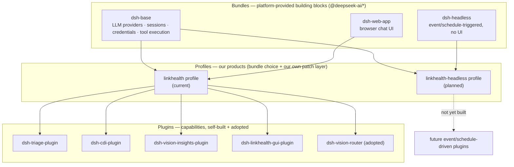

# linkhealth-dsh-platform


DeepSeek Harness (DSH) plugins for [LinkHealth](https://github.com/fmlin0429712024)'s
AI-enablement services for healthcare. This repo is the dedicated home for the
**DSH packaging** of LinkHealth's capabilities — intake triage, clinical
documentation integrity (CDI) auditing, and vision insights (edge people-
counting and retail item tracking) — built on the
[Cordis](https://cordisjs.dev/) plugin runtime.

## Quick start (3 steps)

```sh
git clone https://github.com/fmlin0429712024/linkhealth-dsh-platform.git
cd linkhealth-dsh-platform && pnpm install && pnpm test   # unit + contract checks
dsh --profile linkhealth2 --port 3083                     # full stack → http://127.0.0.1:3083
```

Everything is CI-tested (unit + contract + headless E2E gate) and
auto-deployed to a GCP VM on every push to `main` — see
[docs/ci-cd.md](docs/ci-cd.md).

The core, non-DSH deliverables for each product line live in their own repos;
this repo only carries the DSH plugin layer:

- [`linkhealth-triage`](https://github.com/fmlin0429712024/linkhealth-triage) —
  the intake-triage system (Claude Code Skill + Agents + guardrail hook is the
  core deliverable; DSH packaging is a PoC section there).
- [`clinical-documentation-audit-poc`](https://github.com/fmlin0429712024/clinical-documentation-audit-poc) —
  the CDI audit system and its `.agents/skills` source of truth.

## Architecture: bundle → profile → plugin

Three distinct layers, easy to conflate but worth keeping separate:



- **Bundle**: a published `@deepseek-ai/*` package that provides a whole
  interaction mode. `dsh-base` (core services every profile needs) is
  shared; `dsh-web-app` vs. `dsh-headless` is the one thing that actually
  differs between a chat-driven product and an event/schedule-driven one —
  not "no base," a *different* mode bundle on the same base.
- **Profile**: our choice of bundles (`package.json`'s `dsh.profile.bundles`)
  plus our own plugins, wired in via `cordis.patch.yml`. `linkhealth` is the
  only one running today; `linkhealth-headless` (event/schedule-triggered
  automation, no web UI) is planned, no plugins built for it yet.
- **Plugin**: an individual capability — self-built (the four `plugins/`
  packages below) or adopted from the DSH ecosystem (`dsh-vision-router`,
  see "What's here" below for the adopt-vs-build distinction).

Right now each plugin is inserted into `linkhealth`'s `cordis.patch.yml`
individually. As this grows, the natural next step is grouping related
plugins into our *own* reusable bundle package (e.g. a healthcare-ops
bundle) that any profile — `linkhealth` today, `linkhealth-headless`
tomorrow — can pull in as one unit instead of repeating the same insert
list per profile.

## What's here

| Package | Plane(s) | Status | What it does |
| --- | --- | --- | --- |
| [`plugins/dsh-triage-plugin`](plugins/dsh-triage-plugin) | host | 🟢 active | Classifies/scores/routes inbound business enquiries; hub skill + 3 spoke role prompts + a deterministic guardrail backstop (`phi_involved` ⇒ `requires_human_review`, enforced in code independent of the model). |
| [`plugins/dsh-cdi-plugin`](plugins/dsh-cdi-plugin) | host (client half planned) | 🟢 active | Deterministic SOP-rule evaluation tools for CDI auditing, bundled SQLite rule stores, synthetic gold sets, and a packaged skills snapshot. |
| [`plugins/dsh-vision-insights-plugin`](plugins/dsh-vision-insights-plugin) | host | 🟢 active | Reads structured events (zone occupancy, retail item add/remove) from a separate OpenVINO edge app's data source over HTTP — `query_vision_events` and `query_checkout_events`, both deterministic-facts-in/LLM-narrates-only. Deployed and verified in production. |
| [`plugins/dsh-linkhealth-gui-plugin`](plugins/dsh-linkhealth-gui-plugin) | client | 🟡 early | Branded front door for the DSH web UI — theme, sidebar capability launcher, Settings showcase. Purely additive/reversible; presents all capabilities above without importing any of them (zero business coupling). Two of its four features are still stubs — see its own README. |

The four packages above are **built by us**, live under `plugins/`, and are
covered by the CI/contract-check pipeline. The deployed profile also adopts
plugins **from the wider DSH ecosystem** rather than reimplementing
equivalent functionality — these aren't packages in this repo (no
`plugins/` folder, no README/tests of ours to maintain) and are declared
only in `deploy/profile-linkhealth/cordis.patch.yml`. See
[docs/plugin-development.md](docs/plugin-development.md#adopting-an-existing-plugin-vs-building-a-new-one)
for the convention on when to adopt vs. build:

| Plugin | Origin | What it does |
| --- | --- | --- |
| [`dsh-vision-router`](https://github.com/ysr666/dsh-vision-router) | adopted (npm, third-party) | Gives the text-only DeepSeek main model "eyes": detects image attachments and routes them to a vision backend, then feeds the description back into the conversation. Configured to call a locally-deployed Phi-3.5-vision model — see [docs/deployment-gcp.md](docs/deployment-gcp.md) for the integration wiring. |

All data bundled in this repo (enquiry examples, SOP rule stores, patient gold
sets) is **synthetic/fictional** — no real patient, provider, or client data.

## Vision AI: two integration patterns, one future direction

Two different edge/vision model classes are wired into DSH here — on
purpose, in two different ways, because the models called for it:

| | YOLOv8m (detection/counting) | Phi-3.5-vision (VLM, image Q&A) |
| --- | --- | --- |
| Plugin | **Self-built**: `dsh-vision-insights-plugin` | **Adopted**: `dsh-vision-router` (third-party) + config |
| Pattern | Decoupled data source — model writes structured events; plugin only queries them over HTTP (never touches the model) | Local model as a backend behind an existing general-purpose attachment-vision plugin |
| Proves | DSH can front a narrow, deterministic edge model with a purpose-built query tool | DSH can front a general VLM with **zero custom plugin code** — config only |
| Status | production, live queries | production, verified end-to-end |

**Today this is a capability demo, not a business solution** — the two run
standalone. YOLO counts/tracks; Phi-3.5 answers ad hoc image questions.
Neither uses the other's output.

**The real value is next**: a purpose-built plugin combining detection
(*what/where*, from YOLO) with vision-language reasoning (*what does it
mean*, from Phi-3.5) into one coherent capability for a specific LinkHealth
use case — not two demos running side by side.

## Vision Insights edge apps (`infra/`)

`dsh-vision-insights-plugin` never talks to a camera or a model directly —
it reads structured events over HTTP from a separate, independently-deployed
OpenVINO edge stack that lives under [`infra/`](infra/) (not a pnpm workspace
package, no CI/CD, manually deployed on its own VM by design):

- [`infra/openvino-queue-kit`](infra/openvino-queue-kit) — people-counting /
  capacity-flagging (YOLOv8m INT8).
- [`infra/openvino-self-checkout`](infra/openvino-self-checkout) — retail
  item add/remove tracking (YOLOv8m FP16).
- [`infra/vision-insights-store`](infra/vision-insights-store) — the shared
  SQLite + FastAPI read API both kits feed, and the only thing the DSH
  plugin is allowed to query.

See [`infra/README.md`](infra/README.md) for the directory conventions and
[`docs/PRD-vision-insights.md`](docs/PRD-vision-insights.md) for the full
architecture and decision history (including why this is deliberately
decoupled from DSH rather than a direct plugin↔OpenVINO call).

## Conventions

New plugins should follow the pattern already established by the three above:

- **Naming**: `dsh-<domain>-plugin` (e.g. `dsh-triage-plugin`). The folder
  under `plugins/` always matches the `package.json` `name` exactly — no
  divergence between the two.
- **One package per capability**, not split host/client packages. Host code
  is `lib/index.js` (export `.`); if a capability later grows a client/GUI
  half, it lives at `lib/client.js` in the *same* package (export `./client`)
  — see `dsh-linkhealth-gui-plugin`'s host-noop + client-real split, and
  `dsh-cdi-plugin`'s "Next: Step 2" section for a package planning to grow
  one. Don't create a second `dsh-<domain>-gui-plugin` package.
- **The front-door exception**: a plugin that only *presents* other
  capabilities without importing them (like `dsh-linkhealth-gui-plugin`)
  stays its own package rather than merging into any one capability.
- **Renaming checklist**: `package.json` `name`, `cordis.patch.yml`'s
  `insert[].name`, the header comment in `lib/index.js`/`lib/client.js`, and
  the package's own README all need to move together. The internal Cordis
  `export const name` / patch `insert[].id` values are a separate,
  independent identifier (a bundle-instance name) and don't need to match the
  npm package name — see `dsh-cdi-plugin`'s `id: cdi-plugin` vs. package name
  `dsh-cdi-plugin` for existing precedent.
- **Self-contained**: each plugin bundles its own test/demo data
  (`examples/`, `data/`) — no shared/general data folder. The two domains
  here don't overlap, so centralizing would only add indirection.

## The DSH plugin contract

Every package here is an npm package that plugs into a running DSH/Cordis
instance:

- `package.json` declares either `dsh.bundle.patch` (a host plugin, wired via
  `cordis.patch.yml`) or `dsh.client.platform` (a browser-loaded client
  plugin).
- The entry module (`lib/index.js` for host, `lib/client.js` for client)
  exports `name`, `inject` (the Cordis services it needs, e.g. `tools`,
  `skills`, `theme`), a config schema, and `apply(ctx, config)`, which
  registers behavior and returns a disposer for clean teardown — every
  plugin here is fully reversible.
- Host plugins register tools (`ctx.tools.register`) and/or skills
  (`ctx.skills.registerProvider`); client plugins inject into UI slots
  (`sidebar.footer.action`, `settings.section`, theme tokens).

Each package's own README has the exact install steps for wiring it into a
DSH profile (`~/.dsh/profiles/<name>/`).

## Prerequisites

These plugins target [DeepSeek Harness (DSH)](https://www.npmjs.com/package/@deepseek-ai/cordis)
— you need a working DSH installation to actually run them. The
`@deepseek-ai/*` peer packages (`cordis`, `dsh-tools`, `dsh-skill`,
`schemastery`, `dsh-client-runtime`, `dsh-client-ui-primitives`) are published
on the public npm registry and are provided by a DSH install, not by this
repo.

## Development

This is a [pnpm workspace](https://pnpm.io/workspaces) monorepo.

```sh
pnpm install
pnpm test            # runs each package's test suite where one exists
pnpm test:contract   # plugin contract self-check (naming, paths, exports, tests)
```

All three plugins ship automated tests, run by CI on **every PR and push**
(`pnpm test` — `node --test` for the GUI plugin's pure logic, `python3` for
the triage guardrail script and the CDI deterministic-rule tests, zero
external dependencies). CI additionally runs the zero-dependency plugin
contract check, so any new package under `plugins/` is validated
automatically — **there is no per-plugin CI configuration**.

**Adding a new plugin (including from contributors):** see
[docs/plugin-development.md](docs/plugin-development.md) — the naming
contract, the four testing tiers, the fork-PR secrets constraint, and how to
wire a new plugin into the deployed profile.

## Deployment (GCP)

This repo is the **single source of truth** for the DSH plugins — the GCP VM
is provisioned and deployed exclusively from `plugins/` here:

- `deploy/profile-linkhealth/` — the deployable profile (triage + CDI +
  vision-insights + GUI patch rows, relative paths).
- `deploy/scripts/bootstrap-vm.sh` — one-time VM provisioning (Node 22, dsh
  CLI, release layout, systemd unit).
- `deploy/scripts/deploy.sh` — per-release: unpack → wire CDI module
  resolution → switch `current` symlink → restart → health check.
- `.github/workflows/deploy.yml` — CI/CD: **headless E2E gate** (real LLM
  smoke of the plugins from this checkout) → build the self-contained release
  tarball from `plugins/` → upload → deploy.
- [docs/ci-cd.md](docs/ci-cd.md) — **the one CI/CD playbook to follow**:
  PR flow, push flow, the E2E gate, deploy/rollback, secrets, new-plugin
  onboarding, troubleshooting.
- [docs/deployment-gcp.md](docs/deployment-gcp.md) — VM provisioning details
  (bootstrap, static IP, port map).

## License

MIT — see [LICENSE](LICENSE).
