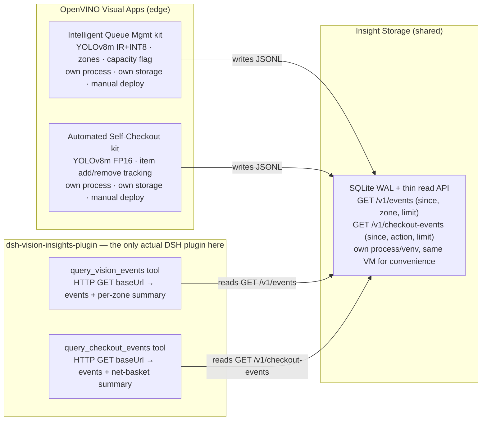

# dsh-vision-insights-plugin

**Status: both `query_vision_events` and `query_checkout_events` implemented,
unit-tested, deployed, and verified end-to-end in production
(`linkhealth-vm2`, 2026-08-19) — see
[docs/PRD-vision-insights.md](../../docs/PRD-vision-insights.md) §9.**

This plugin is the **DSH-side access point for vision insights** — and
nothing more. Per the agreed architecture
([docs/PRD-vision-insights.md](../../docs/PRD-vision-insights.md)), the
OpenVINO visual apps and DSH are **completely separate applications** that
only ever touch through one thing: the shared events data source.

## Architecture — decoupled through the data source



Neither OpenVINO app or this plugin is part of the other's process, storage,
or deploy path. **Routing between the two tools is left to normal
Cordis/LLM function-calling** (tool name + description matching) — no
dispatch/intake layer in front of them; see the PRD §10 for why that
pattern (used by `dsh-triage-plugin`'s `intake-triage` skill) doesn't apply
here. The LLM narrates tool output only — it never sees raw images/video.

**The boundary rule**: the only contract between an OpenVINO app and DSH is
the event shape returned by its endpoint (`GET /v1/events` or
`GET /v1/checkout-events`). Neither OpenVINO app knows DSH exists; this
plugin doesn't know (or care) how the detection happens — YOLOv8m today,
could be swapped for anything tomorrow without touching this package.
Neither side imports, bundles, or directly calls into the other.

**Why decoupled, not a direct plugin↔pose-service call** (what the previous
`assess_exercise_form` tool did): a direct call couples DSH's release cycle
to the vision app's — redeploying one risks breaking the other, and the
plugin can't be tested without the vision app running. Going through a
data-source contract means either side can be deployed, restarted, or
swapped independently; this plugin's tests never need the OpenVINO VM up
(see "Development & test" below).

## Why the previous tool is gone

`assess_exercise_form` (single-frame PT/rehab form check) was retired on
2026-08-19: it coupled DSH directly to an OpenVINO pose endpoint (POST image
→ keypoints), which is exactly the tight coupling the architecture above
avoids, and its attachment-image use case is blocked by the harness
text-route gate anyway (that UX belongs to `dsh-vision-router`). The code
remains in git history (`plugins/dsh-vision-insights-plugin` at commit
`320bc37`).

## The tools

**`query_vision_events(since?, zone?, limit?)`** → `{ events, summary }`
(or `{ events: [], summary: [], error }` on failure — the tool never throws,
it returns a renderable error result). `summary` is a per-zone rollup:
`{ zone, events, overCapacityEvents, maxCount }`.

**Verified in production (2026-08-19)**: asked the deployed agent "Did any
zone exceed capacity in the vision insights data?" — it called this tool
(not a filesystem workaround) and correctly reported `zone0: 14 events, 1
over-capacity, max 5` / `zone1: 14, 0, max 4` / `zone2: 14, 0, max 5`,
matching the read API's data exactly.

**`query_checkout_events(since?, action?, limit?)`** → `{ events, summary }`
(same error shape as above). `summary` is a net-basket rollup:
`{ item, netCount }` — add minus remove per item (the kit's per-detection
`#<tracker id> ` prefix on `class` is stripped so repeat adds/removes of the
same item type merge; items that net to zero, i.e. added then fully removed,
are omitted since they're not currently in the basket).

**Verification history (2026-08-19)**:

1. Local, against a live read API (real HTTP, no mocking): ingested the real
   377-event self-checkout sample run into a throwaway SQLite DB, served it
   with the actual `events_api.py`, and called `queryCheckoutEvents()`
   directly. Result matched an independent Python recount exactly:
   `banana: +23`, `apple: -8`, `bottle` netted to 0 and was correctly
   omitted. The same pass re-ran `query_vision_events` against its fixture
   data as a regression check — unaffected by adding the second tool. One
   real bug was caught here by testing against real sample data rather than
   only synthetic fixtures: the kit sometimes assigns tracker id `"None"`
   (an untracked-detection marker, e.g. `"#None apple"`), which an initial
   digits-only prefix regex (`^#\d+\s+`) failed to strip, splitting that
   item's count into two buckets — fixed to `^#\S+\s+` and pinned with a
   regression test (`test/query-checkout-events.test.mjs`).
2. **Production, through the deployed agent**: after deploying, asked it
   "购物篮里现在还剩什么？" ("what's currently in the basket?") over the
   live web UI. It called `query_checkout_events` (visible in the tool-call
   trace, not a guess) and reported `apple: 8, banana: 42, bottle: 15,
   carrot: 1, orange: 1` — 67 items total. Independently recomputed straight
   from the production read API's raw 335 `checkout_events` rows: identical,
   item for item. (Different numbers from step 1's 377-event local run are
   expected — separate runs of the upstream kit against different dependency
   versions naturally detect somewhat differently; see the self-checkout
   kit's own README "Running" section.)

## Config

| Key | Default | Meaning |
| --- | --- | --- |
| `baseUrl` | `''` | Base URL of the insight data source read API — serves both `/v1/events` and `/v1/checkout-events`. Current production value: `http://10.128.0.11:8090` (the `linkhealth-openvino-vision` VM's internal IP — only reachable from within the same VPC, e.g. from `linkhealth-vm2`; see `deploy/profile-linkhealth/cordis.patch.yml`). Required — both tools error clearly if unset. |

## Development & test

```sh
node --test                                   # lib/query-*.js (HTTP-mocked) + plugin wiring
node scripts/check-plugin-contract.mjs        # repo contract check (from repo root)
```

`test/query-events.test.mjs` and `test/query-checkout-events.test.mjs` cover
each tool's pure query/summary logic with a mocked `fetchImpl` — no real
network call, no dependency on the VM being up. `test/plugin-contract.test.mjs`
covers the Cordis wiring (both tools + the prompt section registered/disposed
correctly). This is the point of the decoupled architecture above: no test
file needs an OpenVINO app or the read API running. For a real-HTTP
round-trip against the read API (no DSH, no mocking) see
`infra/vision-insights-store/README.md` "Testing locally" — that's how the
"Verified locally" claims above were produced.

Everything here is synthetic/test data only (a queue-management simulation
over a stock sample video) — never real patient data, never a clinical
decision.
