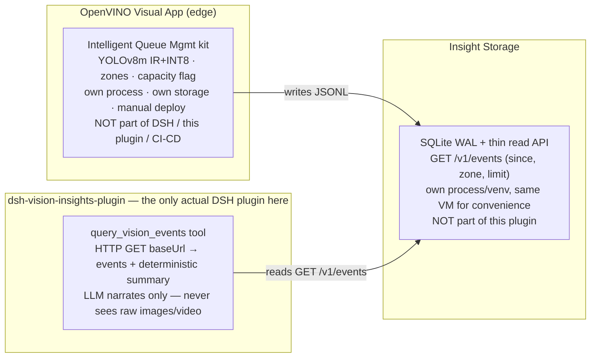

# dsh-vision-insights-plugin

**Status: `query_vision_events` implemented, deployed, and verified
end-to-end in production (2026-08-19, `linkhealth-vm2`).**

This plugin is the **DSH-side access point for vision insights** — and
nothing more. Per the agreed architecture
([docs/PRD-vision-insights.md](../../docs/PRD-vision-insights.md)), the
OpenVINO visual app and DSH are **two completely separate applications**
that only ever touch through one thing: the events data source.

## Architecture — decoupled through the data source



**The boundary rule**: the only contract between the OpenVINO app and DSH is
the event shape returned by `GET /v1/events`. The OpenVINO app doesn't know
DSH exists; this plugin doesn't know (or care) how the counting happens —
YOLOv8m today, could be swapped for anything tomorrow without touching this
package. Neither side imports, bundles, or directly calls into the other.

**Why decoupled, not a direct plugin↔pose-service call** (what the previous
`assess_exercise_form` tool did): a direct call couples DSH's release cycle
to the vision app's — redeploying one risks breaking the other, and the
plugin can't be tested without the vision app running. Going through a
data-source contract means either side can be deployed, restarted, or
swapped independently; this plugin's tests never need the OpenVINO VM up
(see "Development & test" below).

## Why the previous tool is gone

`assess_exercise_form` (single-frame PT/rehab form check) was retired on
2026-08-19: it coupled DSH directly to an OpenVINO pose endpoint (POST image
→ keypoints), which is exactly the tight coupling the architecture above
avoids, and its attachment-image use case is blocked by the harness
text-route gate anyway (that UX belongs to `dsh-vision-router`). The code
remains in git history (`plugins/dsh-vision-insights-plugin` at commit
`320bc37`).

## The tool

**`query_vision_events(since?, zone?, limit?)`** → `{ events, summary }`
(or `{ events: [], summary: [], error }` on failure — the tool never throws,
it returns a renderable error result). `summary` is a per-zone rollup:
`{ zone, events, overCapacityEvents, maxCount }`.

**Verified in production (2026-08-19)**: asked the deployed agent "Did any
zone exceed capacity in the vision insights data?" — it called this tool
(not a filesystem workaround) and correctly reported `zone0: 14 events, 1
over-capacity, max 5` / `zone1: 14, 0, max 4` / `zone2: 14, 0, max 5`,
matching the read API's data exactly.

## Config

| Key | Default | Meaning |
| --- | --- | --- |
| `baseUrl` | `''` | Base URL of the insight data source read API. Current production value: `http://10.128.0.11:8090` (the `linkhealth-openvino-vision` VM's internal IP — only reachable from within the same VPC, e.g. from `linkhealth-vm2`; see `deploy/profile-linkhealth/cordis.patch.yml`). Required — the tool errors clearly if unset. |

## Development & test

```sh
node --test                                   # lib/query-events.js (HTTP-mocked) + plugin wiring
node scripts/check-plugin-contract.mjs        # repo contract check (from repo root)
```

`test/query-events.test.mjs` covers the pure query/summary logic with a
mocked `fetchImpl` — no real network call, no dependency on the VM being up.
`test/plugin-contract.test.mjs` covers the Cordis wiring (tool + prompt
section registered/disposed correctly). This is the point of the decoupled
architecture above: neither test file needs the OpenVINO app or the read API
running.

Everything here is synthetic/test data only (a queue-management simulation
over a stock sample video) — never real patient data, never a clinical
decision.
